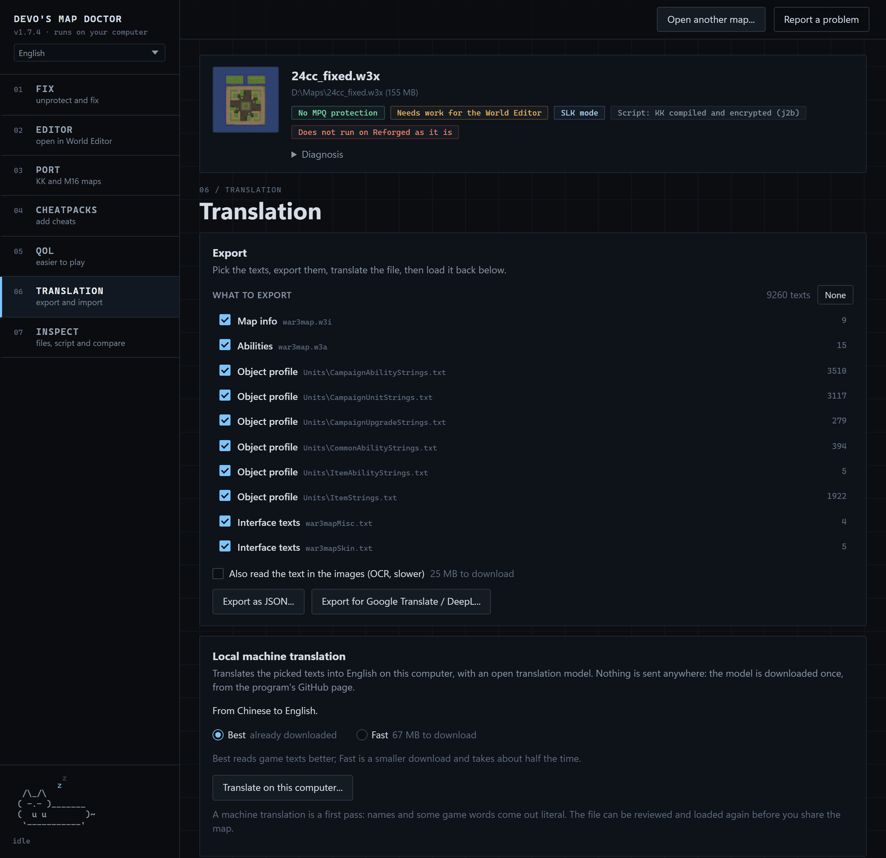
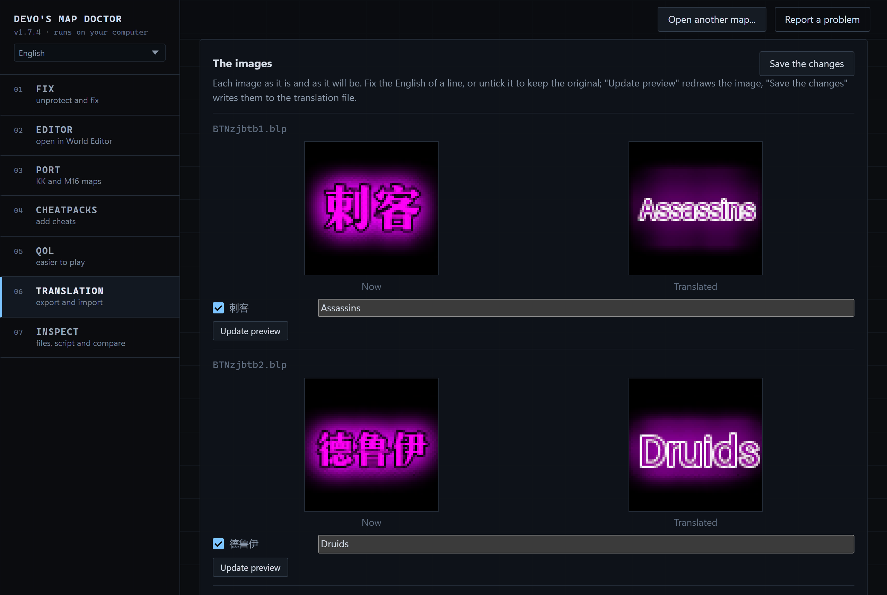
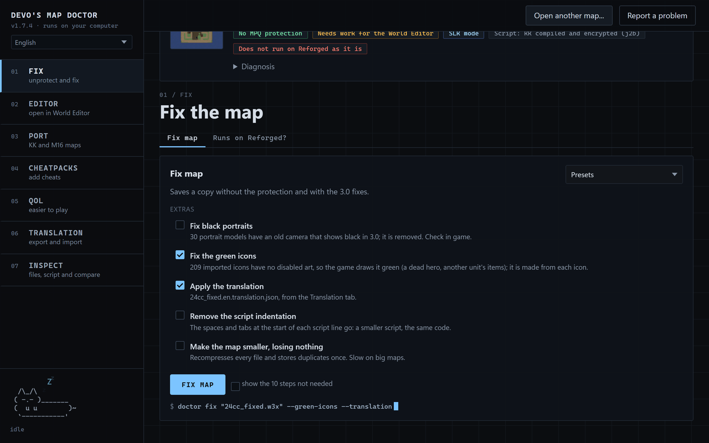

<div align="center">


# Translating maps with the Doctor

Every way to translate a Warcraft III map with Devo's Map Doctor, step by step.

**[Back to the README](README.md)** ·
**[Download](https://github.com/devoltzz/devos-map-doctor/releases/latest)** ·
**[Report a problem](https://github.com/devoltzz/devos-map-doctor/issues/new)**

</div>

Most maps people bring to the Doctor were written in Chinese or Korean. This page shows each way to translate one:
on your computer with a translation model, by hand, with an AI chat or a document translator, and the text painted in
the images. Every way ends the same: a translation file that the Doctor checks against the map and writes into a copy
of it. The map you opened is never changed.

## Contents

- [Which way fits you](#which-way-fits-you)
- [Before you start](#before-you-start)
- [The Translation tab](#the-translation-tab)
- The ways, step by step
  1. [Local machine translation](#1-local-machine-translation)
  2. [Translate the file yourself](#2-translate-the-file-yourself)
  3. [Translate the file with an AI chat](#3-translate-the-file-with-an-ai-chat)
  4. [Google Translate or DeepL](#4-google-translate-or-deepl)
  5. [Review and correct a translation](#5-review-and-correct-a-translation)
  6. [The text in the images](#6-the-text-in-the-images)
- [Apply the translation to the map](#apply-the-translation-to-the-map)
- [The translation file](#the-translation-file)
- [What the Doctor checks](#what-the-doctor-checks)
- [What is never translated, and why](#what-is-never-translated-and-why)
- [Problems and answers](#problems-and-answers)
- [Command line](#command-line)

## Which way fits you

| You want | Use | Into | Where |
|---|---|---|---|
| A playable English version in a few minutes | [Local machine translation](#1-local-machine-translation) | English, from Chinese, Korean, Japanese, Russian, Vietnamese or Thai | the program |
| The best quality, with the names you choose | [Translate the file yourself](#2-translate-the-file-yourself) (or with a friend) | any language | the program, the site, the command line |
| A good translation without typing it all | [An AI chat](#3-translate-the-file-with-an-ai-chat) on the same file | any language | the program, the site, the command line |
| The document translator you already use | [Google Translate or DeepL](#4-google-translate-or-deepl) | any language the service has | the program, the site |
| A machine translation that reads better | [Review and correct](#5-review-and-correct-a-translation) | | the program, the site |
| The text painted in buttons, banners and loading screens | [The text in the images](#6-the-text-in-the-images) | English, or any language by hand | the program |

> [!TIP]
> The ways mix well. A common path: the local machine translation first, then fix the names and the few lines that
> read wrong in the same file, then apply it.

**The site and the program.** [doctor.devoltz.party](https://doctor.devoltz.party) exports, checks and applies a
translation like the program does. The local machine translation and the text in the images (and its review) are
only in the program for Windows and Linux: on the site, the machine translation card says "Only in the program for
Windows and Linux."

**JASS and Lua maps.** The texts of a JASS script are exported. The texts of a Lua script are not: in a Lua map the
script keeps its own texts, and everything else (map info, strings, objects, profiles, frames, images) is translated
as usual. The tags under the map's name say which script it has ("Script: ...").

**KK maps and Port to Reforged.** The script of a KKWE or j2b map is encrypted, so its texts cannot be exported as it
is. Port the map first, then translate the ported copy. See [the order with Port to Reforged](#translate-before-or-after-port-to-reforged).

## Before you start

The Doctor collects the texts a player sees, from these files. The Translation tab lists them with how many texts each
has, and you can untick the ones you do not want.

| In the list | What it is |
|---|---|
| Map info | `war3map.w3i`: the map name, author, description, suggested players, loading and prologue screens, player and force names |
| Trigger strings | `war3map.wts`: the strings the map data and the triggers point to (`TRIGSTR_...`) |
| Script | `war3map.j`: the texts of the JASS script that reach the screen (messages, dialogs, quests, boards, frames) |
| Units, Items, Abilities, Buffs, Upgrades, Destructables | the object data (`war3map.w3u`, `.w3t`, `.w3a`, `.w3h`, `.w3q`, `.w3b`, and their `war3mapSkin` twins): names, tooltips, descriptions |
| Object profile | the map's own `Units\*.txt` files, where maps saved in SLK mode keep their tooltips |
| Interface texts | the `[FrameDef]` texts of `war3mapSkin.txt` and `war3mapMisc.txt` (armor and damage tips, resource labels) |
| Frame definitions (FDF) | the `Text` of each frame of a custom interface |
| Images | with "Also read the text in the images": the text drawn in the map's pictures, read by OCR |

Hotkeys, file paths and fields only the World Editor shows are never part of it.

## The Translation tab

Open the map ("Open map..." or drop it on the window), then click **TRANSLATION** on the left.



- **Export**: "What to export" lists the files, ticked. "None" and "All" untick or tick them all. "Export as JSON..."
  and "Export for Google Translate / DeepL..." write the file to translate.
- **Local machine translation**: the language the Doctor found ("From Chinese to English."), "Best" or "Fast", and
  "Translate on this computer...".
- **Import**: "Load a translation..." reads a translated file and checks it against the map. The result shows
  under it: how many texts pass the checks, and a table with each text left out and why.

## 1. Local machine translation

An open translation model ([OPUS-MT](https://github.com/Helsinki-NLP/Opus-MT), University of Helsinki) translates the
texts into English on your computer. Nothing is sent anywhere.

1. Open the map and go to **TRANSLATION**.
2. In "What to export", untick what you do not want translated. Leave everything ticked for a full translation.
3. Optional: tick "Also read the text in the images (OCR, slower)" to translate the text painted in the images too
   (see [the text in the images](#6-the-text-in-the-images)).
4. In "Local machine translation", pick "Best" or "Fast".
5. Click "Translate on this computer..." and choose where to save the file (it suggests `<map>.en.translation.json`).
6. Wait. The first time, the model is downloaded. A big RPG takes 2 to 4 minutes on a common processor.
7. The file is loaded and checked by itself: the Import card shows how many texts pass.
8. [Apply the translation](#apply-the-translation-to-the-map).

| Language | Best | Fast |
|---|---|---|
| Chinese | 220 MB | 70 MB |
| Korean | 200 MB | 68 MB |
| Russian | 220 MB | 67 MB |
| Japanese | | 64 MB |
| Vietnamese | | 62 MB |
| Thai | | 68 MB |

"Best" reads game texts better. "Fast" is a smaller download and takes about half the time. Japanese, Vietnamese and
Thai have one model.

What the Doctor does around the model, so you do not have to:

- The color codes, line breaks, `%s`, the numbers and the tooltip data references (`<AHbz,DataA1>`) never go through
  the model. They are put back in place after.
- A name with one color per character is translated as one name and colored again, word by word.
- A list of levels is translated level by level, and each distinct piece once, so the same text reads the same
  everywhere.
- Common game words (stats, damage, cooldown, item slots) come from a word list. A piece that loses a number is
  translated again until it keeps it.
- Every result goes through [the same checks](#what-the-doctor-checks) as a file a person translated. A text that
  fails keeps its original.

The models come from the [`translation-models`](https://github.com/devoltzz/devos-map-doctor/releases/tag/translation-models) release of
this repository, checked by size and sha256 before use, and kept in `%LOCALAPPDATA%\DevosMapDoctor\models` (Windows)
or `~/.local/share/DevosMapDoctor/models` (Linux).

> [!NOTE]
> A machine translation is a first pass. Names and some game words come out literal (an "Archmage" may come out as
> "Great Magician"). Read it in game, then [correct it](#5-review-and-correct-a-translation) before you share the map.

## 2. Translate the file yourself

The best quality, into any language, by you or by a friend who reads the original.

1. Open the map and go to **TRANSLATION**.
2. Pick the files in "What to export".
3. Click "Export as JSON..." and save the file.
4. Open it in a text editor that saves UTF-8 (VS Code, Notepad++, Notepad on Windows 10 and newer).
5. For each entry, write the translation in `"translation"`. Leave it empty to keep the original text. You can stop
   halfway: what is empty stays as it is.
6. Keep [the codes](#what-you-can-change-and-what-you-cannot) as they are. The `"context"` line tells you where each
   text is used.
7. Translating into Chinese, Japanese or Korean? Set `"language"` at the top of the file to `zh`, `ja` or `ko`.
8. Save the file, then click "Load a translation..." in the Import card and pick it.
9. Look at the table of texts left out, fix those lines in the file, and load it again until you are happy.
10. [Apply the translation](#apply-the-translation-to-the-map).

> [!TIP]
> A big map has thousands of texts. Split the work: one person takes the objects, another the script. Untick files in
> "What to export" to make smaller files. Each file applies on its own, and an empty translation never overwrites
> another file's work.

## 3. Translate the file with an AI chat

Export the JSON file as in [way 2](#2-translate-the-file-yourself), then give it to the AI chat you use. Big files go
better in parts of a few hundred entries. Tell it what it must keep. A prompt that works:

```
This is a translation file of a Warcraft III map (JSON). Translate each "text" into English and
write it in "translation". Return the same JSON, with the same entries in the same order.

Rules:
- Change only "translation". Never change "id", "source", "file", "context", "text" or "note".
- Keep every color code (|cffRRGGBB ... |r) and |n in the same order. Keep %s, %d and every number.
- Keep the tooltip references like <A000,DataA1> or <ACbr,Dur1> exactly as they are.
- When each character has its own color, keep the codes between whole words, with a space
  before the code: "Fire |cffff8000Rain |cffffff00Bow".
- "script" entries are JASS strings: keep \" and \\ as they are, and write no real line break.
- "profile" entries with commas are lists of levels: keep the same number of commas.
- Chat commands like -save or -random stay as they are.
- Entries with a "note" saying the script compares them: give every entry with that text the same
  translation.
- Translate each name the same way everywhere. Use the official English name for anything from
  Warcraft or another known game.
- Write no notes, no comments, and never mention translation or AI inside the texts.
```

Then load the file with "Load a translation...", as in steps 8 to 10 of way 2.

> [!WARNING]
> The Doctor refuses a line that mentions AI or translation ("translated by", "TN:", "machine translation"), a line
> that lost a color code, and a line with Chinese, Japanese or Korean left in it. The rest of the file still applies.
> Look at the table of texts left out and send those lines back to the chat.

## 4. Google Translate or DeepL

Document translators take a web page, not JSON. The Doctor writes one for them.

1. Open the map and go to **TRANSLATION**.
2. Pick the files in "What to export".
3. Click "Export for Google Translate / DeepL..." and save the `.html` file.
4. Give the file to the document translation of your service and save the translated `.html` it gives back. DeepL
   takes `.html` documents. If your service does not, use [way 2](#2-translate-the-file-yourself) or
   [way 3](#3-translate-the-file-with-an-ai-chat).
5. Click "Load a translation..." and pick the translated `.html`.
6. [Apply the translation](#apply-the-translation-to-the-map).

The page is a table: the id and the original stay in gray cells marked "do not translate", and the game codes inside
each text are marked the same way, so the service leaves them alone. Only the last column is translated. Lines where
the service still broke a code are left out, and shown in the table.

> [!NOTE]
> The text in the images is not part of the `.html` export. Use the JSON export or the local machine translation for
> it.

## 5. Review and correct a translation

Any translation file can be corrected and loaded again, also one the local machine translation wrote.

1. Open the `.json` file in a text editor.
2. Search for the names that came out wrong and fix them. A name the script compares (an entry with a `"note"`) must
   get the same translation in every entry that has it.
3. To bring a line back to the original, empty its `"translation"`.
4. Save, then click "Load a translation..." and pick the file again. "Forget this translation" drops the loaded file.
5. [Apply the translation](#apply-the-translation-to-the-map) to a new copy of the original map.

> [!TIP]
> A new version of the map? Load your old file on it. Each entry is matched by its id and its original text, so every
> text that did not change still applies. The changed ones are shown as left out, and a new export gives you the new
> texts.

## 6. The text in the images

Many maps draw their text inside the pictures: buttons, banners, the loading screen. The Doctor reads it with a text
reader ([PaddleOCR](https://github.com/PaddlePaddle/PaddleOCR) models, on your computer, 15 to 27 MB downloaded the
first time) and redraws the translation in its place. Only in the program.

1. Open the map and go to **TRANSLATION**.
2. Tick "Also read the text in the images (OCR, slower)". It shows when the map's language has a text reader.
3. Click "Translate on this computer..." (the images are translated into English with the rest), or "Export as
   JSON..." to translate them yourself. Image entries have `"source": "image"`.
4. Once the file is loaded, click "Review the images (N)...".
5. Each image shows as it is ("Now") and as it will be ("Translated"). Fix the English of any line, or untick a line
   to keep the original. "Update preview" redraws the image.
6. Click "Save the changes": they go into the translation file, which is checked again.
7. [Apply the translation](#apply-the-translation-to-the-map).



- Every image of the map is read: BLP, TGA, PNG and JPG. The four parts of a loading screen are read as one picture.
- A title in two lines is translated as one sentence, and the words are spread over the two lines again.
- On a plain background the original text is erased and the translation is written in its color. On a picture the
  translation goes on an opaque band, so nothing of the original shows through.
- The image is written back in its own format.
- Font sheets (the glyphs of a font, damage numbers) are left alone, and so is a lone character on a texture: that is
  what a text reader finds in leaves and stones.

## Apply the translation to the map

A loaded translation becomes an option of two actions, in their "Extras" group: **"Apply the translation"**.



1. Load the translation in the Import card (the local machine translation loads its own).
2. Go to **FIX** ("Fix map") or **EDITOR** ("Open in World Editor").
3. Make sure "Apply the translation" is ticked. Its line names the file.
4. Click "Fix map" (it writes `<map>_fixed.w3x`) or "Open in World Editor" (`<map>_editor.w3x`), next to the map.
5. The report says "Applied the translation." Test the map in game before you share it.

What happens when it writes:

- The map is copied, and only the files with translated texts are replaced. Every other file is read back and compared
  byte for byte, and each translation is read back at its place. If anything does not match, nothing is written.
- A protected map is unprotected by the same action first. Keep "Remove the MPQ protection" ticked in Fix map.
- A text the script compares goes in together with the script's own copies of it, so the comparison still matches.

## The translation file

The JSON file the export writes, shortened (the entries come from two real maps, one Korean and one Chinese):

```json
{
 "format": "devos-map-doctor-translation",
 "version": 1,
 "map": "U9_FormingRPG_0.4.w3x",
 "map_name": "FormingRPG 0.4",
 "language": "",
 "help": ["Fill \"translation\" for each entry you translate; leave it empty to keep the original text.", "..."],
 "entries": [
  {
   "id": "obj:war3map.w3a:A000:atp1:1",
   "source": "object",
   "file": "war3map.w3a",
   "context": "ability A000 (사령관에게로 이동), Tooltip level 1",
   "text": "사령관에게로 이동|cffffcc00(W)|r",
   "translation": "Move to the Commander|cffffcc00(W)|r"
  },
  {
   "id": "txt:Units\\ItemAbilityStrings.txt:acbr:ubertip",
   "source": "profile",
   "file": "Units\\ItemAbilityStrings.txt",
   "context": "Units\\ItemAbilityStrings.txt [acbr] ubertip",
   "text": "在<ACbr,Dur1>秒内提高<ACbr,DataA1,%>%的攻击速度。",
   "translation": "Increases attack speed by <ACbr,DataA1,%>% for <ACbr,Dur1> seconds."
  },
  {
   "id": "script:089f88c1fa4d",
   "source": "script",
   "file": "war3map.j",
   "context": "function Trig_JN_Object_AutoSave_Actions: call DisplayTimedTextToForce(...,\"|c0080FF00자동 저장 완료|r\")",
   "text": "|c0080FF00자동 저장 완료|r",
   "translation": "|c0080FF00Auto save complete|r"
  },
  {
   "id": "script:a7762a2330f0",
   "source": "script",
   "file": "war3map.j",
   "context": "function Trig_Auto_Save_Start_Actions: ...",
   "text": "시",
   "note": "Also used as a key by the script: those 2 copies stay as they are.",
   "translation": "h"
  }
 ]
}
```

| Field | What it is |
|---|---|
| `id` | where the text lives in the map. Never change it. |
| `source`, `file`, `context` | where the text comes from and how the map uses it, to help you translate. |
| `text` | the original. Never change it: the Doctor matches it against the map. |
| `note` | a rule for this entry (see below). |
| `translation` | yours. Empty keeps the original. |
| `language` (top) | the language you translate into, only needed for `zh`, `ja` or `ko`. |

### What you can change and what you cannot

| In the text | Example | Rule |
|---|---|---|
| Color codes | `\|cffffcc00(W)\|r` | Keep every one, in the same order. Move them to wrap the same words. |
| Line breaks | `\|n` | Keep them where they make sense. Adding or dropping one is allowed. A real line break is not (except where the original has one). |
| Format codes | `%s`, `%d` | Keep every one. The script puts a value there. |
| Tooltip references | `<ACbr,DataA1,%>`, `<Awrh,Dur1>` | Copy them as they are. The game writes the ability's number there. Never write the number yourself. |
| Numbers | `40`, `15%` | Keep them. Writing `10万` as `100000` or `100,000` passes. |
| Level lists | `A Lv1,A Lv2` | A `profile` text with commas has one part per level: keep the same number of commas. |
| Script texts | `\"`, `\\` | Keep the escapes. No new double quote, no lone backslash. |
| Chat commands | `-save`, `-random` | Keep them, also inside a tooltip that quotes them. |
| One color per character | `\|cff..火\|cff..雨` | Keep the codes between whole words, with a space before the code. The Doctor also adds that space itself when a code glues two words. |

### The notes

- **"The script compares this text: give every entry with it the same translation."** The script checks this text
  against a value it reads from the map (a class name in a tooltip, an item type). Give every entry with the same
  text the same translation, or none of them is applied. The script's own copies are translated along.
- **"Also used as a key by the script: those N copies stay as they are."** The text shows on screen and is also a key.
  The screen copies take your translation. The key copies stay, so saved data is still found.

## What the Doctor checks

Every non-empty translation is checked before anything is written. A line that fails is left out, the rest applies.
The Import card lists the left-out lines with the reason.

| The reason you see | What it means | What to do |
|---|---|---|
| color codes changed | a `\|c...` or `\|r` is missing, extra or moved out of order | copy the codes from `text` |
| numbers changed | a number of the original is missing or different | keep every number; keep `<...>` references instead of their values |
| format codes (%s, %d) changed | a `%s` or `%d` is missing or extra | keep them all |
| level commas changed | a list of levels got more or fewer commas | one part per level, as in the original |
| Chinese, Japanese or Korean text left | part of the line was not translated | translate it, or set `language` if you translate into one of them |
| mentions AI or translation | the line has "AI", "translated by", "TN:", "machine translation" and the like | remove the note |
| a real line break (use \|n) | a new line inside the text | use `\|n` |
| double quotes in a data value | a `"` in a profile text that had none | use `'` instead |
| a double quote without a backslash in a script text | a `"` in a script text | write `\"`, or use `'` |
| a lone backslash in a script text | a `\` not followed by `"`, `\`, `n`, `r` or `t` | write `\\` |
| escaped quotes changed | the number of `\"` changed | keep the same `\"` |
| a line starting with } (it ends a wts string) | a line of a trigger string starts with `}` | move the `}` |
| a real line break in a profile value | a profile or frame text got a new line | use `\|n` |
| much longer than the original | more than about three and a half times the original | shorten it |
| longer than the 1023 bytes the classic game reads in an object text | see [the shops are empty](#the-shops-are-empty-after-translating) | shorten it |
| the script compares this text: every entry with it needs the same translation | entries with the compare note got different translations, or some none | give them all the same |
| the script compares this text: no double quote or backslash in its translation | a compared script text cannot carry those | rephrase |
| the text in the map is not the one in the file | the file was made from another version of the map | export again from this map |
| the image in the map is not the one in the file | the image changed since the file was made | export again with the images |
| repeated id in the file | the same entry is twice in the file | keep one |

Entries whose id the map does not have are counted as "not in this map" and skipped.

## What is never translated, and why

Some texts look like text but are part of how the map works. Translating them breaks the map without any error, so
they stay out of the file.

| Never exported | Why |
|---|---|
| Keys: `StringHash("...")`, hashtable and game cache keys, sync prefixes (`DzSyncData`, `BlzSendSyncData`), frame names | the map saves and finds its data by these names. A translated key no longer finds what was saved under the old one. |
| Texts the script compares: `if s == "..."`, `SubString`, `StringLength` | the comparison would never match again. Reforged also counts the bytes of a text, and a translation changes its length. |
| Chat commands the script listens to (`-save`) | the player types them and the script compares them. |
| A name the script reads by position (`SubStringBJ(GetUnitName(u), 11, 19) == "..."`) | a piece of the translated name is not the piece the script expects. |
| A text both compared and used as a key | the same reason, twice. |
| A text the script hands to its own function, keeps in a variable or returns, and then compares with a value from outside the script (an object name, the chat, a player name), searches for, or uses as a frame name or platform save key | the same reason, one step away. A text the script only searches (`"Fire;Ice;"` searched for `"Stun;"`) is translated when it does not hold the searched word, and a text compared only with other texts of the script is translated, since the same text always gets the same translation. |
| The word the script searches for in a text (`JNStringContains(tooltip, "Recovery")`, `JNStringReplace`, `JNStringSplit`) | the text it is searched in may stay in the original. |
| Paths, models, animations, orders, sounds, effects | they are not text a player reads. |
| Game string keys (`GetLocalizedString`) | the game has the text. |
| The debug messages of the Wurst compiler | a player only sees them when the map breaks. |
| The code Port to Reforged adds to the script | it is the Doctor's own code (the local save, the hash tables). It stays byte for byte. |
| Hotkeys, editor-only fields | not shown in game. |
| Texts that are not valid UTF-8 | the file could not hold them. |

A text the script both shows and compares stays whole in the original, because translating only the screen copy would
leave the comparison in the old language. To see how many texts were left out and for what reason, run
`doctor translation export map.w3x texts.json --json` and look at `"skipped"`.

## Problems and answers

### The shops are empty after translating

Classic game (1.24 to 1.29) only. That game reads each text of the object data into a buffer of 1024 bytes, and one
longer text breaks the loading of that whole file: shops empty, no drops, no starting items. English is short in
characters but a long tooltip can pass the limit.

Since 1.7.5, a map made for the classic game that keeps every object text within 1023 bytes gets that limit on its
translations. The check leaves out a longer line, and the local machine translation cuts a long text at the last line
break that fits. If you translated such a map with 1.7.4 or older, translate the original map again with the new
version. If you translate by hand and see the message, shorten that tooltip.

### Some texts stayed in Chinese (or Korean)

| Where | Why | What to do |
|---|---|---|
| Lines in the table of texts left out | they failed a check | fix them in the file and load it again |
| Lines the machine translation could not keep | the result lost a code or a number, so the original stays | translate those lines by hand |
| Texts in buttons and pictures | they are drawn in the image | tick "Also read the text in the images (OCR, slower)" |
| Every script text of a KK map | the script is encrypted (KKWE, j2b) | port the map first, then translate the ported copy |
| Every script text of a Lua map | Lua script texts are not exported | the rest of the map is translated |
| Texts the script compares or uses as keys | on purpose, see [what is never translated](#what-is-never-translated-and-why) | leave them |

### The tooltip got cut

- On a classic map, the local machine translation cuts an object text longer than 1023 bytes at a line break (see
  above). Write a shorter version of it in the file and load it again.
- In the interface (boards, custom frames), Reforged uses a wider font than the one many Chinese and Korean maps
  picked, and English is longer. A text wider than its box is cut by the game. Use a shorter translation.

### Words glued together ("FireRainBow")

Item names with one color per character. The Doctor puts the space back when it applies the translation. Keep the
codes between whole words: `Fire |cffff8000Rain |cffffff00Bow`.

### Can I translate into a language other than English?

Yes, by the file: [way 2](#2-translate-the-file-yourself), [way 3](#3-translate-the-file-with-an-ai-chat) or
[way 4](#4-google-translate-or-deepl) take any language. For Chinese, Japanese or Korean, set `"language"` to `zh`, `ja`
or `ko`. Maps in English can be exported and translated the same way. The local machine translation only translates
into English, from Chinese, Korean, Japanese, Russian, Vietnamese and Thai.

### Translate before or after Port to Reforged?

After. Port the map first, then open the `<map>_reforged.w3x` and translate it.

- Before the port, the script of a KK map is encrypted and its texts cannot be exported.
- The code the port adds stays out of the translation and comes back byte for byte.
- If you translated a ported map with a version older than 1.7.0, port the original map again and translate it with
  the new version: older versions translated the port's own code too, which broke the save.

### "The map is protected"

The translation is written into a copy that has to be unprotected first. Use "Fix map" with "Remove the MPQ
protection" ticked, and "Apply the translation" in the same run.

### The machine translation does not download

The models come from GitHub. Check the connection and try again: a model is checked before use, so a broken download
is never used. On a computer without internet, copy the `DevosMapDoctor\models` folder from another computer to the
same place (see [way 1](#1-local-machine-translation)).

## Command line

The same jobs from a terminal (`doctor.exe` on Windows, the program itself on Linux):

```
doctor translation groups map.w3x
doctor translation export map.w3x texts.json
doctor translation export map.w3x texts.html
doctor translation export map.w3x texts.json --only=war3map.wts,war3map.w3t --images
doctor translation machine map.w3x english.json
doctor translation machine map.w3x english.json --quality=fast --images
doctor translation check map.w3x texts.json
doctor fix map.w3x --translation=texts.json
doctor editor map.w3x --translation=texts.json
```

| Command | What it does |
|---|---|
| `translation groups` | the files the texts come from, with the key `--only=` takes |
| `translation export` | writes the file to translate: JSON, or the web page for a document translator when the name ends in `.html` |
| `translation machine` | the local machine translation into English, written and checked |
| `translation check` | what would apply and what would be left out, writing nothing |
| `fix` / `editor --translation=` | applies the translation to a copy of the map |

| Option | Meaning |
|---|---|
| `--only=<file>,...` | only the texts of these files (`war3map.w3i`, `war3map.wts`, `war3map.j`, `war3map.w3u`, `Units\ItemStrings.txt`...) |
| `--images` | the text in the images too (export and machine) |
| `--quality=best` or `fast` | the model of the machine translation (`best` when the language has it) |
| `--json` | prints everything the job returned, with the texts left out and why |

A text the script compares goes out with every entry that has it, also from files `--only=` left out: they have to be
translated together.
