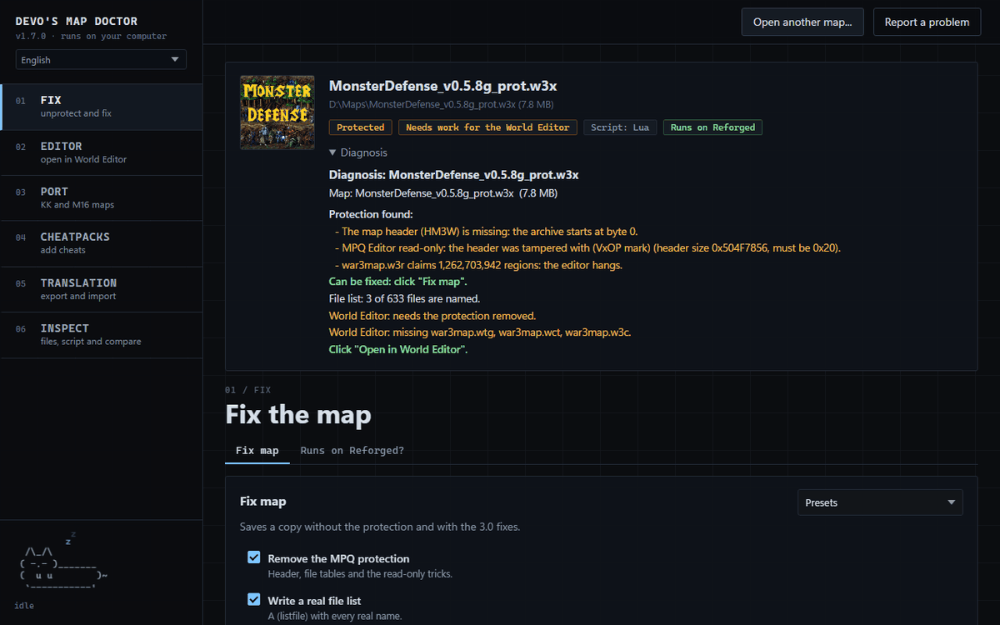
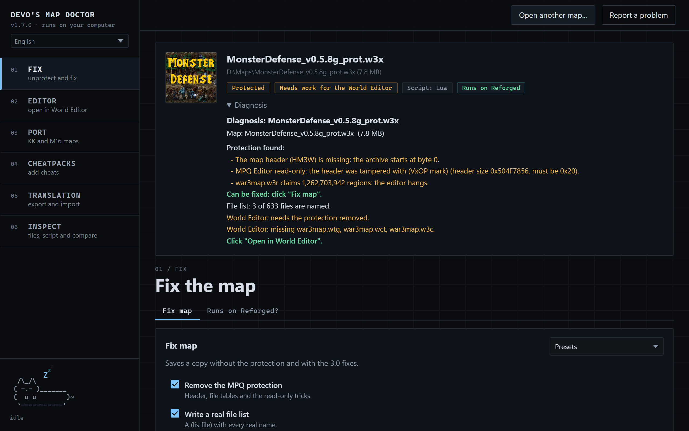
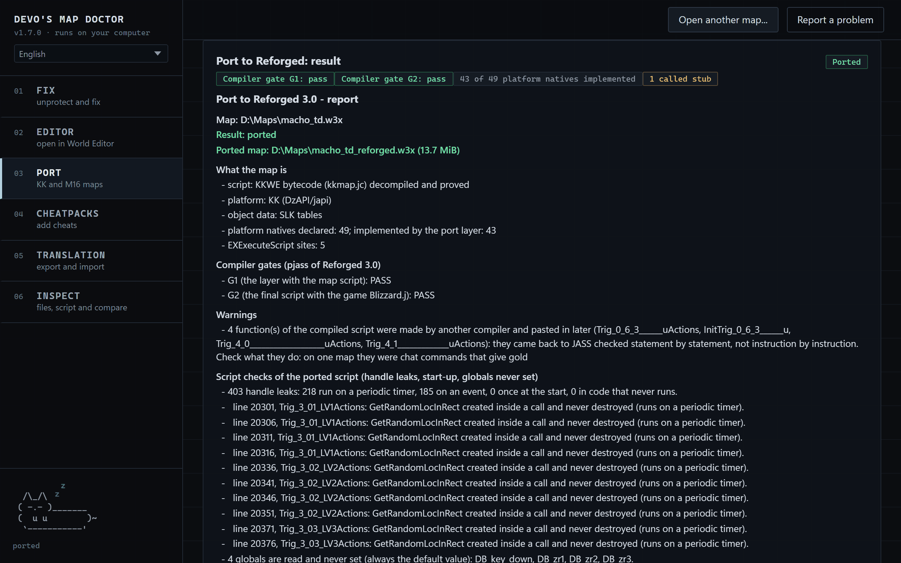

<div align="center">


# Devo's Map Doctor

Open, fix and port Warcraft III maps for Reforged.

[](https://github.com/devoltzz/devos-map-doctor/releases/latest)
[](https://github.com/devoltzz/devos-map-doctor/releases)
[](LICENSE)
[](#get-it)

**[Download](https://github.com/devoltzz/devos-map-doctor/releases/latest)** ·
**[Use it in the browser](https://doctor.devoltz.party)** ·
**[Report a problem](https://github.com/devoltzz/devos-map-doctor/issues/new)**



</div>

## What it does

The Doctor opens protected maps, repairs what stops them on Reforged 3.0, rebuilds the World Editor files and ports
the maps of the Chinese KK and Korean M16 platforms. It shows what a map carries before anything is written, and it
never runs the game.

| Action | What it does |
|---|---|
| **Fix map** | Removes the protection and repairs the map: fake file tables, scrambled ids, data the 3.0 engine refuses, broken SLK tables, models that crash the game, portrait cameras, data pointers, ability lists, single player. Extras for the map card, the translation and the size. |
| **Open in World Editor** | Writes a copy the editor opens, with the GUI triggers rebuilt from the script when the round trip proves them. |
| **Port to Reforged** | KK, KKWE, DzAPI, YDWE and j2b maps get their natives implemented and their scripts back in JASS. Maps whose game runs on the YDWE Lua engine become Reforged Lua maps (their Lua 5.3 bytecode translated to source). |
| **QoL** | A quality of life version of the map: more experience, gold, lumber, item drops and craft success, a faster hero revive, a -noshake command, the map revealed, VIP for everyone. |
| **Tabs** | Map card, "Runs on Reforged?", files (previews, raw codes), script and its checks, triggers, translation export and import, compare two versions, cheat packs. |

<table>
<tr>
<td width="50%"></td>
<td width="50%"></td>
</tr>
<tr>
<td align="center">The diagnosis, as soon as a map opens</td>
<td align="center">A KK map ported, with both compiler gates passed</td>
</tr>
</table>

### New in 1.7.1

- A new QoL tab: a quality of life version of an old RPG, made from its own script. Experience, gold and lumber multipliers, item drop and craft success chances (100% at most, tiers kept), a shorter hero revive, a -noshake command, the map revealed and VIP for everyone. The item tables of the World Editor and the revive at an altar follow the same multipliers. Lua maps take every edit too, the rolls and the revive waits of their code included. The tab shows what the map has for each one before anything is written.
- The JASS parser reads vJass too, and a map with vJass that was never compiled gets a clearer report.

### New in 1.7.0

- Port to Reforged now handles maps whose game runs on the YDWE Lua engine: they become Reforged Lua maps, tested in
  game up to their custom interface (clicks, frames, textures, on-screen translation).
- "Balance huge numbers": life, damage, mana, armor and attributes above the game's integer limit are scaled down,
  keeping the proportions.
- j2b maps with the newer encryption (`2SAJ3raw`) are decrypted, and many older KK maps now port.
- Translating a ported map no longer touches the port's own code, so saves keep working.
- Object data in the format of the 3.0 editor (version 3) is read and written by every repair that needs it.
- Ported maps get the exact model for `DzSetUnitModel`, and models with non UTF-8 names stay apart.
- New option to remove the script indentation, and more single player locks are found and removed.
- Faster: the script parsers and the SLK passes now run in native code (Rust), with the same results.

The full notes are on the [release page](https://github.com/devoltzz/devos-map-doctor/releases).

## Get it

### In the browser

[doctor.devoltz.party](https://doctor.devoltz.party) is the same program, run in your browser. Your map never leaves
your computer, and the page works offline after the first visit. Chrome, Edge and Firefox on a computer; maps up to
450 MB.

### Windows

Get `DevosMapDoctor.exe` and `names.npz` from [Releases](https://github.com/devoltzz/devos-map-doctor/releases) and keep them in the same
folder. Nothing to install. The program tells you when a new version is out.

### Linux

Get `DevosMapDoctor-linux-x86_64` and `names.npz`, keep them in the same folder, then:

```
chmod +x DevosMapDoctor-linux-x86_64
```

One file, for x86-64 systems with glibc 2.35 or newer (Ubuntu 22.04+, Debian 12+, Fedora 36+, Mint 21+). The window
uses the system's GTK and WebKitGTK, as the Windows one uses WebView2:

```
sudo apt install gir1.2-webkit2-4.1     # Debian, Ubuntu
sudo dnf install webkit2gtk4.1          # Fedora
```

The command line needs nothing. To port maps, point `WC3_GAME` at the Warcraft III 3.0 folder (under Wine or Lutris).

### Command line

The same jobs as the window: `doctor <command> <map> [options]`. On Windows, `doctor.exe` appears next to the program
the first time you open it. On Linux it is the program itself (`./DevosMapDoctor-linux-x86_64 fix map.w3x`). The page
shows the command of each action under its button.

```
doctor diag map.w3x
doctor fix map.w3x --unprotect --listfile --portraits
doctor editor map.w3x
doctor port map.w3x
doctor check map.w3x
doctor cheatpacks map.w3x
doctor cheat map.w3x --pack=nzcp --set activator=-cheat
doctor qol map.w3x --xp=2 --gold=2 --drop=2 --respawn=0.5
doctor translation export map.w3x texts.txt
doctor fix map.w3x --translation=texts.txt
doctor files map.w3x
doctor extract map.w3x war3map.j --to=out
doctor --help
```

The report goes to the output and the progress to stderr (`--quiet`: none). `--json` prints what the job returned.

| Exit code | Meaning |
|---|---|
| 0 | done |
| 1 | failed |
| 2 | wrong command line |
| 3 | done with leftovers |

## Limits

Nothing touches the file you opened: a new one is written next to it, and every output is checked file by file. Some
protections can only be partly undone; the report says what was left. Test the map in game before sharing it.

## Building

`pip install -r requirements.txt`, then `python build.py` writes `dist/DevosMapDoctor.exe` and the `doctor.exe` it
carries (from `launcher/doctor_launcher.c`). With Rust installed, `cargo` also builds the script checks of
`native/jass_checks`, which otherwise run in Python.

`python build_linux.py` writes `dist/DevosMapDoctor-linux-x86_64` in a Docker container (`linux/Dockerfile`), from
Windows or Linux.

The site is built from the same code by `web/build_site.py`. The `site` workflow attaches it to each release, and
`deploy/` serves it.

## Problems

Use "Report a problem" in the window: it opens an issue here with the report filled in.

## Thanks

- [caiohsr14](https://github.com/caiohsr14), for the exact models of `DzSetUnitModel` and the unique ASCII names of
  models whose names are not UTF-8 (#9).
- sangje_wc3, whose w3x2lni with 3.0 support pointed out gaps the Doctor now covers in its own code.

## License

MIT, see [LICENSE](LICENSE). Third-party code is listed in [THIRD_PARTY_NOTICES.md](THIRD_PARTY_NOTICES.md).
